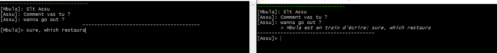

# Go Real-Time gRPC Chat

[](https://golang.org)
[](https://opensource.org/licenses/MIT)

A minimalist yet robust real-time terminal chat application built with Go, demonstrating advanced concepts like gRPC bi-directional streaming, concurrency, Terminal UI manipulation, and SOLID design principles.

This repository showcases the evolution of a chat system from a simple line-by-line messenger to a sophisticated real-time keystroke streaming experience.

### Demo (Version 2.0)



---

## Core Concepts Demonstrated

-   **gRPC Bi-directional Streaming**: establishes a long-lived, two-way communication channel between clients and the server for maximum efficiency and low latency.
-   **Concurrency in Go**: efficiently handles simultaneous I/O operations (reading keyboard input, receiving network data) using goroutines and channels.
-   **TUI in Raw Mode**: uses the `golang.org/x/term` package to control the terminal, capturing individual keystrokes instead of waiting for a full line.
-   **Advanced Terminal Manipulation**: implements a flicker-free UI in the terminal by precisely controlling the cursor and redrawing only the necessary parts of the screen.
-   **Clean Architecture & SOLID Principles**: the server is a simple, decoupled message router, while the client handles all UI logic. This makes the system maintainable and easy to extend.

## Features

### Version 1.0 (Tag: `v1.0`) - Line-by-Line Chat

-   A classic chat experience.
-   Users type a message and press `Enter` to send it.
-   The server broadcasts the final message to all other connected clients.
-   A great example of a basic gRPC bi-directional streaming implementation.

### Version 2.0 (Tag: `v2.0` / `main` branch) - Real-Time Keystroke Streaming

-   A modern, real-time "live" chat.
-   **See what others are typing, as they type it.**
-   A "user is typing..." indicator appears for other clients, updating with every keystroke.
-   Pressing `Enter` commits the message to the permanent chat history.
-   Handles backspace correctly, both locally and for remote viewers.
-   A simple, flicker-free terminal UI that separates chat history from live typing indicators.

## Project Structure

```
.
├── client/
│   └── client.go         # the client application logic
├── server/
│   └── main.go         # the gRPC server logic
├── chatpb/
│   ├── chat.pb.go      # generated Protobuf Go code
│   └── chat_grpc.pb.go # Generated gRPC Go code
├── proto/
│   └── chat.proto          # The gRPC service and message definition
├── images/
│   └── chat.PNG     # demo image of my terminals
├── go.mod
├── go.sum
└── README.md
```

## Getting Started

### Prerequisites

-   Go (version 1.18 or newer, but I am testing using go 1.24.4)
-   [Protocol Buffers Compiler (protoc)](https://grpc.io/docs/protoc-installation/)

### Installation & Setup

1.  **Clone the repository:**
    ```bash
    git clone https://github.com/assu-2000/ioPipeChat.git
    cd ioPipeChat
    ```

2.  **Install gRPC and Protobuf Go plugins:**
    ```bash
    go install google.golang.org/protobuf/cmd/protoc-gen-go@v1.28
    go install google.golang.org/grpc/cmd/protoc-gen-go-grpc@v1.2
    ```
    Ensure your `$GOPATH/bin` is in your `PATH` environment variable.

3.  **Generate gRPC code from the `.proto` file:**
    From the root of the project, run:
    ```bash
    protoc --go_out=. --go_grpc_out=. proto/chat.proto
    ```
    This will generate/update the files inside the `chatpb/` directory.

### Running the Application

You will need three separate terminal windows.

1.  **Start the Server:**
    In the first terminal, run:
    ```bash
    go run server/main.go
    ```
    You should see the output: `Server listening on port 50051`

2.  **Start the 1st Client (e.g., Assu):**
    In the second terminal (git bash), run:
    ```bash
    go run client/client.go Assu
    ```

3.  **Start the 2nd Client (e.g., Vanessa):**
    In the third terminal, run:
    ```bash
    go run client/client.go Vanessa
    ```

Now you can start typing in either client's terminal and see the real-time updates in the other!

### Switching Between Versions

This repository uses git tags to mark the different versions.

-   **To see the final, real-time version (default):**
    ```bash
    git checkout main   # or git checkout v2.0
    ```
-   **To see the simpler, line-by-line version:**
    ```bash
    git checkout v1.0
    ```
    Remember to run `go mod tidy` if you switch between versions.

## Architectural Overview

The system is designed to be highly decoupled:

-   **The `proto` contract** is the single source of truth for the API. It defines how the client and server must communicate, regardless of their internal implementation.
-   **The Server** acts as a stateless message hub. Its only job is to receive a message from one client and broadcast it to all other connected clients. It doesn't care about the content or the UI.
-   **The Client** is responsible for all user interaction and presentation logic. It captures keyboard input, manages the terminal's raw mode, and renders the TUI. It decides *what* to send to the server (typing updates vs. final messages).

This separation of concerns makes the system easy to reason about and extend.

## Future Roadmap

This project serves as a strong foundation. The clean architecture allows for straightforward extensions, including:

-   **[ ] Chat Rooms**: Modify the server to manage connections on a per-room basis.
-   **[ ] Authentication**: Implement a gRPC interceptor to validate user tokens (e.g., JWT).
-   **[ ] Persistence**: Have the server store final messages in a database like PostgreSQL or a key-value store like BadgerDB.
-   **[ ] Scalability**: Integrate a message broker like **Kafka** or **Redis Pub/Sub** to handle message distribution in a multi-server environment.

## Contributing

Contributions, issues, and feature requests are welcome! Feel free to check the [issues page](https://github.com/assu-2000/ioPipeChat/issues).

## License

This project is licensed under the MIT License.